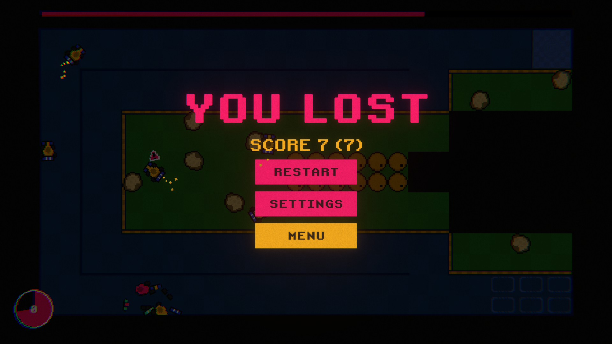

# SwitchNest
Three circuits are available, each with increasing difficulty, and a highscore system is included. I implemented the main menu, an in-game menu, SFX/music management, and a particle system.

You must survive and finish each round quickly, as the timer is always running. At the end of each round, a bot will replay your previous run (including velocity, inputs, and rotation). The bot will behave exactly as you did, so you'll need to memorize patterns to avoid colliding with them.

If a car takes damage, a warning will appear above it. If it takes damage again, you lose the game. Your goal is to complete as many rounds as possible without dying and to keep all your bots alive. (1 completed round = +1 score).

# Instructions
Extract .zip and double click .exe

# Images
<table>
	
  <tr>
  	<td></td>
    <td></td>
    <td></td>
  </tr>
</table>
